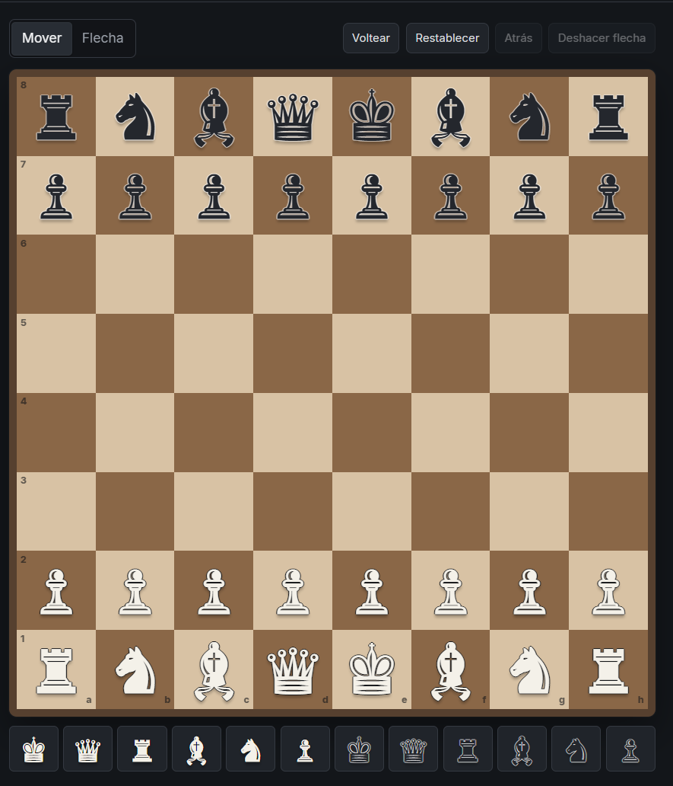

# Chess Anki Maker

A local editor for creating chess cards for Anki. Build normal study cards or interactive trainers for practising openings and other move sequences, with click-through diagrams, still images, or animated GIFs.

Chess Anki Maker creates the required Anki note type automatically and exports an `.apkg` file ready to import.
