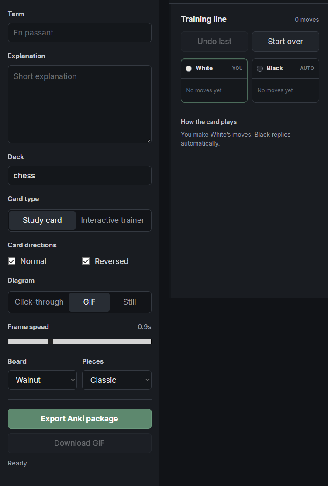

# Chess Anki Maker

Chess Anki Maker is a local editor for creating standard and interactive chess cards for Anki. Arrange a position, record a move sequence, choose a click-through diagram, still image, or GIF, then export an `.apkg` file.

   
  Arrange positions and annotate move sequences directly on the board.

The editor panel controls the card text, direction, diagram format, animation speed, board theme, and piece style. In interactive trainer mode, the training line separates the side you play from the opponent’s automatic replies, letting the card check each move and advance through an opening or tactical sequence.

   
  Card settings on the left; interactive training controls on the right.

Importing the package creates the required Anki note type automatically, so no manual card-template setup is needed.
